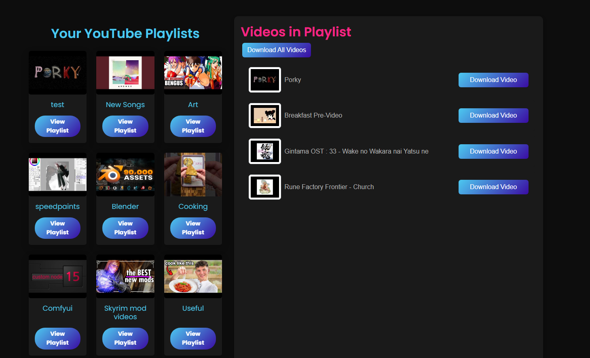

# Yumu

A YouTube playlist downloader

### The Problem

As time goes on, I find an increasing number of videos on playlists that I've made to be missing, and sometimes when I try to find the exact same video, it's just completely wiped from the face of the net. So as a precaution, I've been downloading the videos I really like onto my computer/mobile device using third-party websites, but the fact of the matter is that a lot of these websites just don't end up working as intended; they only allow single video downloads at a time or are littered with advertisements that make the overall experience quite difficult. YouTube itself allows users to download videos for offline use, but the method of preservation is counterintuitive. This is because once a user goes online again, the videos that were removed by YouTube will be subsequently deleted from your account (and without notice too!).

### The Solution

So instead of relying on others to preserve my beloved videos, I've decided to just make my own web app that downloads videos from my playlists, hosted for myself and others for personal use. Doing this solves both the advertisement and preservation problems at once, allowing me to create an interface that is clean and responsive, with nothing stopping the user from downloading any video (so long as the video is available) and keeping it forever. I've also made it possible to download the user's entire playlist at once, so they don't have to mindlessly click through links and download buttons.

### The Method

Considering all I've written so far, I would need a plan of what tools/services are required and how they would work together so that I could realize the desired functionality of Yumu. So I'll outline the overall thought process of what went into making this app:

- A responsive interface is something that I really wanted for users. I want the page to update in real-time as I click through my interface, so I've chosen React as the framework for a really fast front end.
- I want to be able to download videos from YouTube, so Google's API services are necessary for getting that precious data.
- Once the desired video data is captured, I need to be able to download the desired videos. This is where the two key primary tools are used: `ytdl-core` to download videos and `ffmpeg` to merge the downloaded videos with their high-quality audio.

 

| **Tools**             |
|-----------------------|
| **Express**           |
| **React**             |
| **PostgreSQL**        |
| **Bcrypt**            |
| **Passport.js**       |
| **CORS**              |
| **Google APIs**       |
| **Express-Session**   |
| **pg (node-postgres)**|

